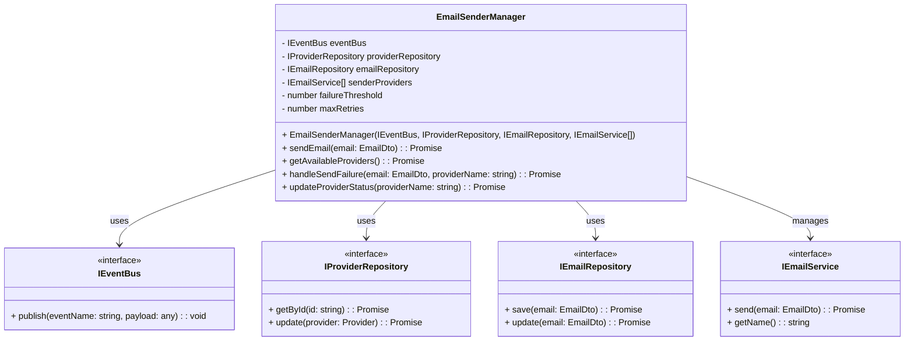
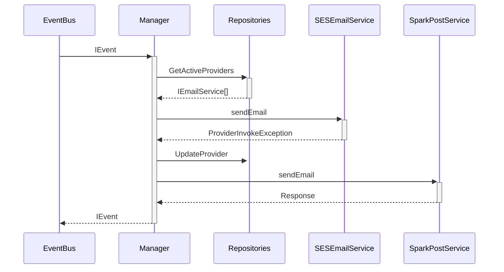

# Mailer-Platform - Serverless Application
This project is a **serverless application** designed for managing email campaigns and handling email provider configurations. It is built with **Node.js** and **TypeScript** and leverages modern serverless services, including **AWS Lambda**, **SQS**, **API Gateway**, and **DynamoDB**, all orchestrated using **SAM/CloudFormation**. The frontend is developed with **ReactJS** using **Typescript + Vite**, providing a lightweight and fast client-side experience.

## Overview
The application combines a **traditional REST API** with an **event-driven architecture**, allowing flexibility and scalability for different use cases. It follows clean architecture principles, focusing on **Domain-Driven Design (DDD)** and **SOLID principles** to ensure maintainability and modularity.

### Technologies Used
- **Node.js**: Backend runtime environment for building serverless functions.
- **TypeScript**: Strongly typed language for maintainable and robust development.
- **Hono.dev**: High-performance and lightweight HTTP framework tailored for serverless environments.
- **AWS Lambda**: Serverless compute service to handle backend logic.
- **AWS SQS**: Message queue system for asynchronous communication and event processing.
- **AWS DynamoDB**: NoSQL database for managing emails and providers efficiently.
- **Swagger**: Provides REST API documentation.
- **Jest**: Test framework for unit tests, integrated with **jest-stare** for reporting.

```plaintext
/src
/application #        Business logic and use cases
/domain #             Entities, value objects, and contracts
/infra #              Infrastructure implementation
/__tests__ #          Unit tests to verify code behavior
/tdd-reports #        TDD reports and code coverage
```

# Email Sender Manager - Serverless Application
This project is a **serverless application** designed for managing email campaigns and handling email provider configurations. It is built with **Node.js** and **TypeScript** and leverages modern serverless services, including **AWS Lambda**, **SQS**, **API Gateway**, and **DynamoDB**, all orchestrated using **SAM/CloudFormation**. The frontend is developed with **Vite**, providing a lightweight and fast client-side experience.

---

## Core Component: EmailSenderManager

The `EmailSenderManager` class is the backbone of the email-sending functionality. It handles the orchestration between email providers and ensures failover mechanisms are implemented for reliability.

### Key Responsibilities:
1. **Email Sending**:
   - Sends emails through the available providers based on their priority.
   - Implements retries for failed attempts and updates the status of emails in DynamoDB.
2. **Provider Management**:
   - Maintains a list of active providers using `IProviderRepository`.
   - Updates provider availability after multiple consecutive failures.
3. **Event-Driven Design**:
   - Publishes events to `IEventBus` for email-related actions (e.g., `EmailSent`, `EmailFailed`).
   - Consumes events from SQS to process email requests asynchronously.

### Design Patterns 
EmailSenderManager combine many patterns to solve a performant orchestrator to reduce the fail states, where the most highlights would be: 
-   **Strategy Pattern**: Handles dynamic provider selection for email sending.
-   **Chain of Responsibility Pattern**: Manages failover by passing the email-sending request through a chain of providers until one succeeds.
-   **Observer Pattern**: Facilitates event-driven behavior by notifying other parts of the system about email-sending outcomes.

These patterns combine to create a scalable, resilient, and modular implementation of the `EmailSenderManager`

### Class Diagram


> [!INFO]
> How works the Pattern Strategy

